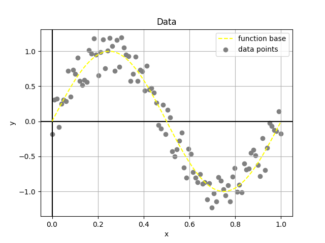
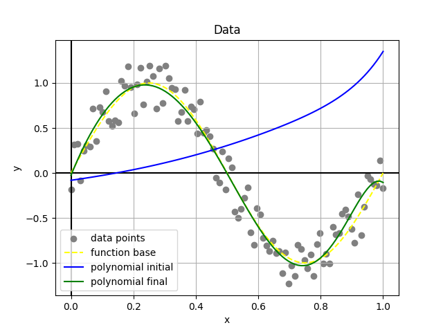
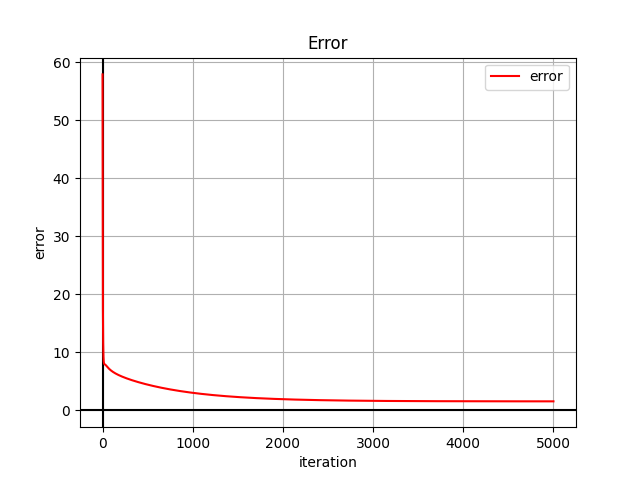
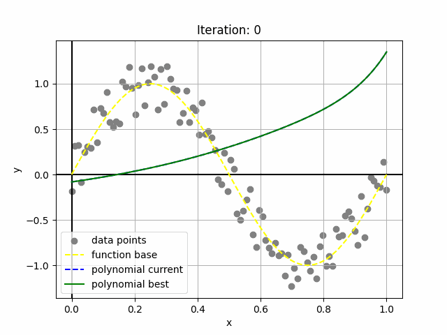

# Universidad Autónoma de Yucatán

## Facultad de Matemáticas

### Machine Learning

**Teacher:** Dr. Victor Uc Cetina

**Student:** Dayan Bravo Fraga

# Task1: Stochastic Gradient Descent

**GitHub**: https://github.com/dayan3847/machine_learning/tree/master/stochastic_gradient_descent

### Generate artificial data points

Generate 100 artificial data points (xi, yi) where each xi is randomly generated from the interval [0, 1]
and yi = sin(2πxi) + ε. Here, ε is a random noise value in the interval [−0.3, 0.3].

#### Code

[](https://colab.research.google.com/github/dayan3847/machine_learning/blob/master/stochastic_gradient_descent/colab/1_generate_artificial_data_points.ipynb)

#### Output



### Implement the Stochastic Gradient Descent algorithm

Implement in your favorite programming language the Stochastic Gradient Descent algorithm to solve the regression
problem using the 100 data points you generated.

#### Code

[](https://colab.research.google.com/github/dayan3847/machine_learning/blob/master/stochastic_gradient_descent/colab/2_stochastic_gradient_descent.ipynb)

#### Output

````json
{
  "alpha": 0.1,
  "iterations": 5000,
  "polynomial_degree": 10,
  "training_time": 37.49029326438904,
  "final_error": "1.5594998421397501",
  "initial_parameters": "0.3368430232767716*x**10 + 0.27219210357538715*x**9 + 0.1159717320822019*x**8 - 0.4138054277935391*x**7 - 0.22175986590580077*x**6 + 0.22484676435163797*x**5 - 0.12142737327005382*x**4 + 0.3370932222345827*x**3 + 0.405684035977932*x**2 + 0.4968946679808558*x - 0.08190341619880104",
  "final_parameters": "-4.756648857493773*x**10 - 2.6840187169305274*x**9 - 0.0700422779029662*x**8 + 2.5847554404321937*x**7 + 5.74619910357791*x**6 + 7.576181805796508*x**5 + 4.593121512991505*x**4 - 4.412238250609398*x**3 - 17.11073015532505*x**2 + 8.45356043167721*x - 0.026098954418209405"
}
````

### Plot Results

#### Code

[](https://colab.research.google.com/github/dayan3847/machine_learning/blob/master/stochastic_gradient_descent/colab/3_plot_results.ipynb)

#### Output Data



#### Output Error



### Create Animation

#### Code

[](https://colab.research.google.com/github/dayan3847/machine_learning/blob/master/stochastic_gradient_descent/colab/4_create_animation.ipynb)

#### Output



### Report in PDF

[Report](doc/out/reportStochasticGradientDescentSinusoidal.pdf)
