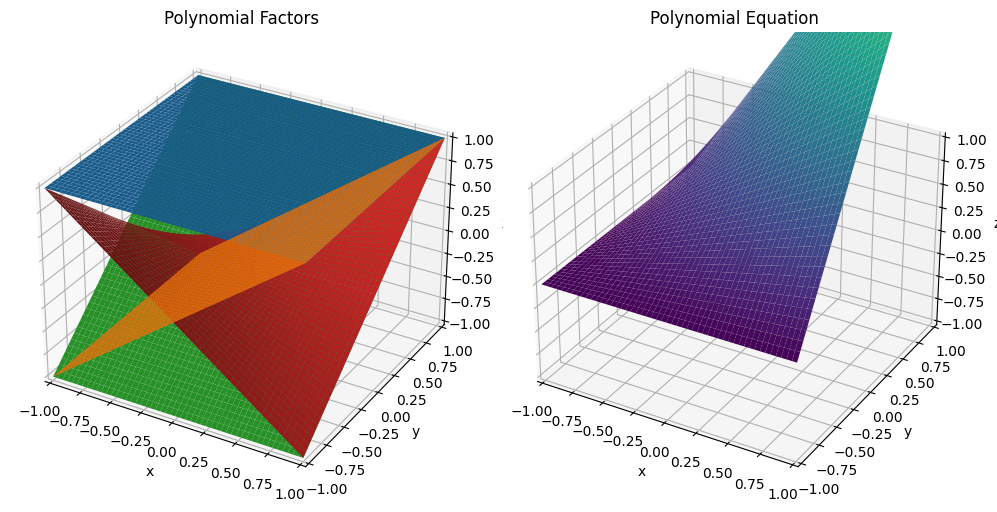
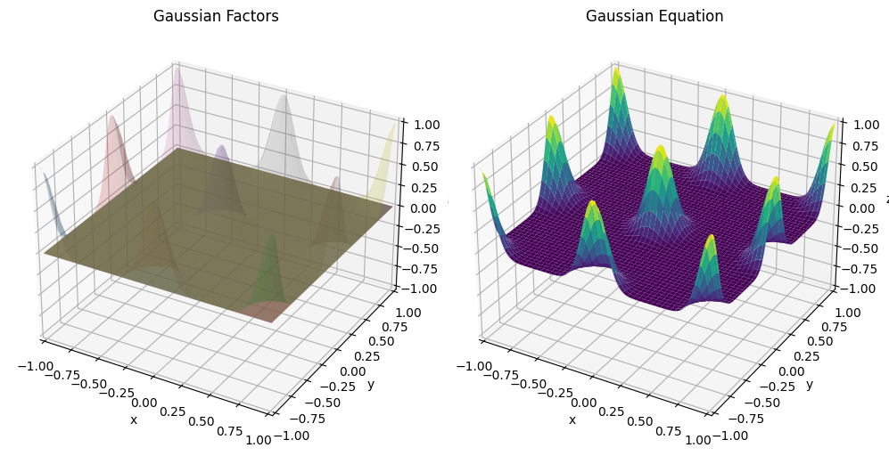
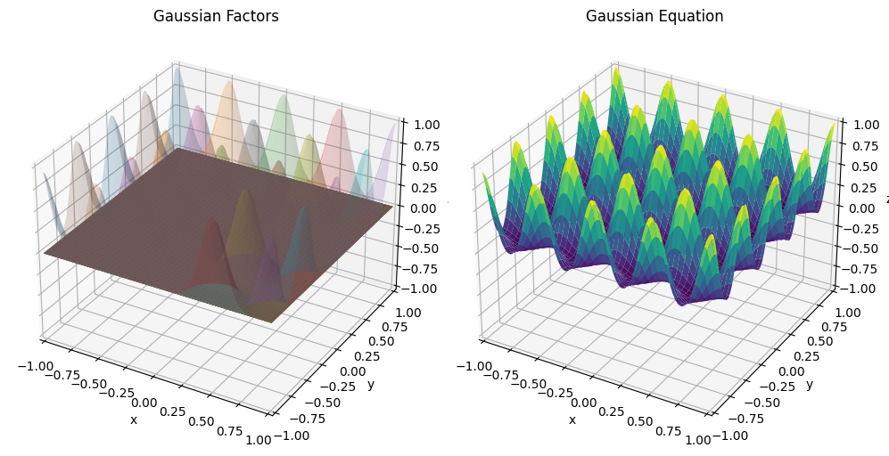
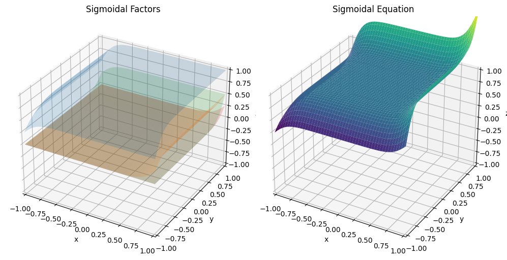
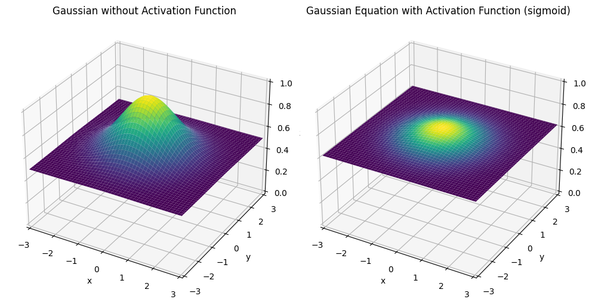
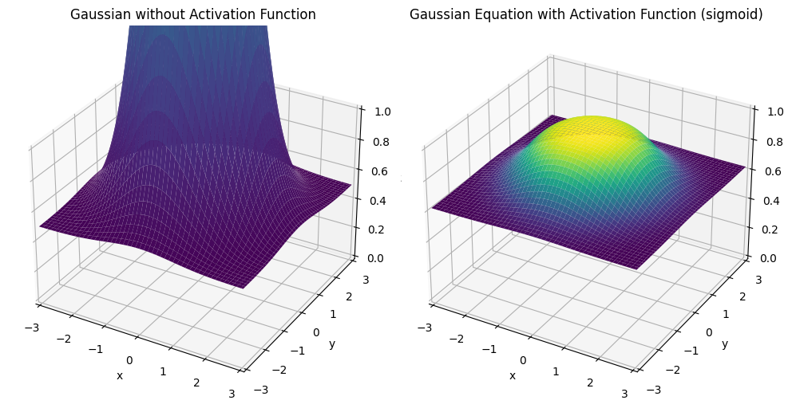
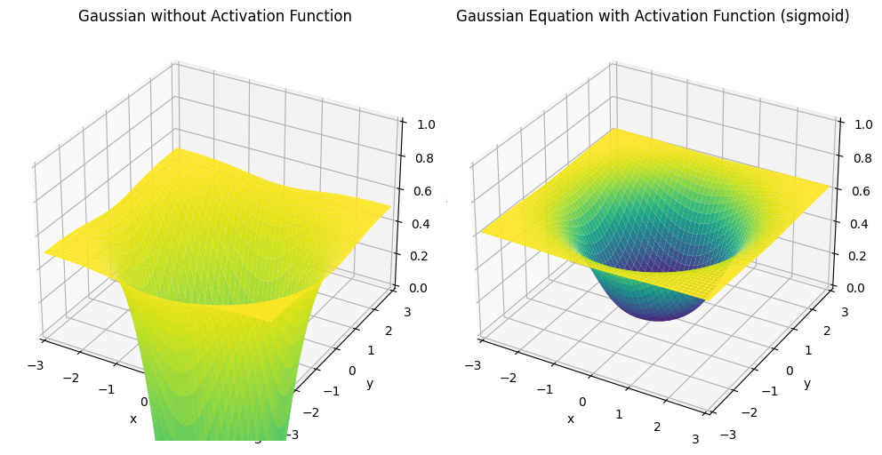

# Machine Learning

### Universidad Autónoma de Yucatán _Facultad de Matemáticas_

**Teacher:** Dr. Victor Uc Cetina <[victoruccetina@gmail.com](mailto:victoruccetina@gmail.com)>

**Student:** Ing. Dayan Bravo Fraga <[dayan3847@gmail.com](mailto:dayan3847@gmail.com)>

# [Basis Functions 2D](https://github.com/dayan3847/machine_learning/blob/master/dayan3847/basis_functions/basis_functions.ipynb) 

## Preview

### Polynomial

### Gaussian

### Sigmoid

# [Basis Functions 3D](https://github.com/dayan3847/machine_learning/blob/master/dayan3847/basis_functions/basis_functions_3d.ipynb)  

## Preview

### Polynomial

### Gaussian

#### 9 Gaussians

#### 25 Gaussians

### Sigmoid

# [Analysis of the sigmoid activation function in the Gaussian](https://github.com/dayan3847/machine_learning/blob/master/dayan3847/basis_functions/basis_gaussian_3d.ipynb) 

## Weight 0.5

## Weight 5

## Weight -5

