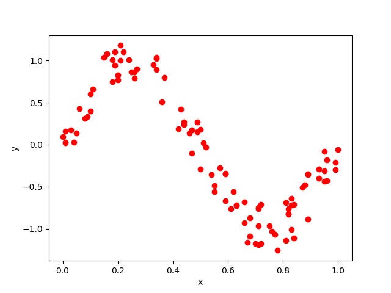
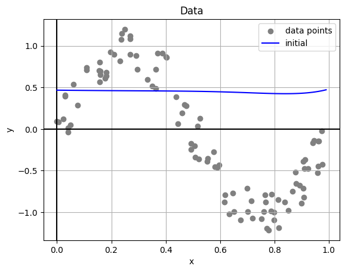
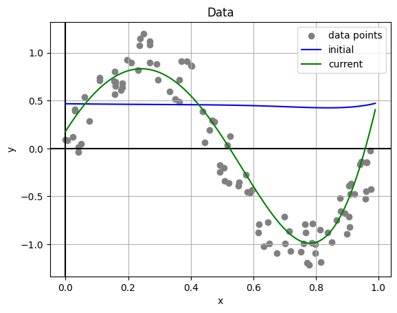
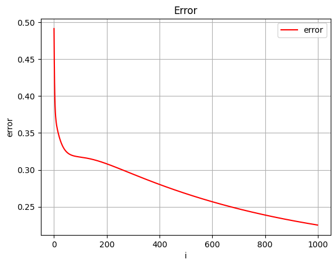

# Universidad Autónoma de Yucatán

### Maestría en Ciencias de la Computación

## Machine Learning

**Teacher:** Dr. Victor Uc Cetina

**Student:** Dayan Bravo Fraga

## Task1: Stochastic Gradient Descent

**GitHub**: https://github.com/dayan3847/mcc_ml_task1

### Generate artificial data points

Generate 100 artificial data points (xi, yi) where each xi is randomly generated from the interval [0, 1]
and yi = sin(2πxi) + ε. Here, ε is a random noise value in the interval [−0.3, 0.3].

#### Output

Artificial points have been generated:

### Initialize Polynomial Regression Model

#### Output

Artificial points have been generated:

### Implement the Stochastic Gradient Descent algorithm

Implement in your favorite programming language the Stochastic Gradient Descent algorithm to solve the regression
problem using the 100 data points you generated.

#### Output

Artificial points have been generated:

### Graph Error

#### Output

Artificial points have been generated:

### Final Report

[Report](./reports/reportStochasticGradientDescentSinusoidal.pdf)