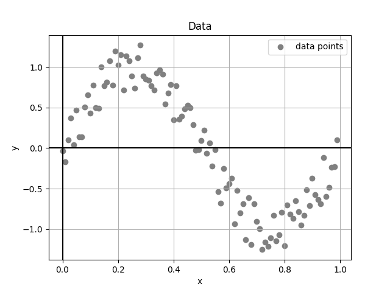

# Universidad Autónoma de Yucatán

### Maestría en Ciencias de la Computación

## Machine Learning

**Teacher:** Dr. Victor Uc Cetina

**Student:** Dayan Bravo Fraga

## Task1: Stochastic Gradient Descent

**GitHub**: https://github.com/dayan3847/mcc_ml_task1

### Step 1: Generate artificial data points

Generate 100 artificial data points (xi, yi) where each xi is randomly generated from the interval [0, 1]
and yi = sin(2πxi) + ε. Here, ε is a random noise value in the interval [−0.3, 0.3].

#### Code:

```python
class StochasticGradientDescent:

    ### ... ###

    def __init__(self):
        # Artificial Count
        self.m: int = 100
        self.x_interval = (0, 1)
        self.epsilon_interval = (-.3, .3)

        self.data_point = None

    def get_x_list(self):
        step = (self.x_interval[1] - self.x_interval[0]) / self.m
        return np.arange(self.x_interval[0], self.x_interval[1], step)

    def noise(self):
        return self.random(self.epsilon_interval)

    def source_function(self, x):
        return math.sin(2 * math.pi * x)

    def generate_data_points(self):
        if self.data_point is not None:
            return
        self.data_point = {
            'x_list': self.get_x_list(),
            'y_list': [],
        }
        for x in self.data_point['x_list']:
            e = self.noise()
            y = self.source_function(x) + e
            self.data_point['y_list'].append(y)

```
:::
#### Output:



### Step 2: Implement the Stochastic Gradient Descent algorithm

Implement in your favorite programming language the Stochastic Gradient Descent algorithm to solve the regression
problem using the 100 data points you generated.

#### Code

```python
```

#### Output

1. Artificial points have been generated:


