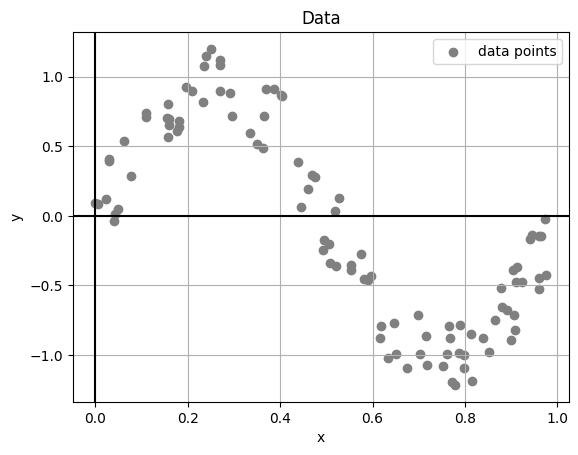

# Universidad Autónoma de Yucatán

Maestría en Ciencias de la Computación

## Machine Learning

**Teacher:** Dr. Victor Uc Cetina

### Task1: Stochastic Gradient Descent

#### Description

1. Generate 100 artificial data points (xi, yi) where each xi is randomly generated from the interval [0, 1]
   and yi = sin(2πxi) + ε. Here, ε is a random noise value in the interval [−0.3, 0.3].

2. Implement in your favorite programming language the Stochastic Gradient Descent algorithm to solve the regression
   problem using the 100 data points you generated.

#### Code

```python
# import libraries
import math
import random
import matplotlib.pyplot as plt

# config
artificial_count: int = 100
x_interval: tuple[float, float] = (0, 1)
epsilon_interval: tuple[float, float] = (-0.3, 0.3)

# generate artificial data points
x_list: list[float] = []
y_list: list[float] = []
for i in range(artificial_count):
    x: float = random.random() * (x_interval[1] - x_interval[0]) + x_interval[0]
    e: float = random.random() * (epsilon_interval[1] - epsilon_interval[0]) + epsilon_interval[0]
    y: float = math.sin(2 * math.pi * x) + e
    x_list.append(x)
    y_list.append(y)

# plot artificial data points
plt.plot(x_list, y_list, 'ro')
plt.xlabel('x')
plt.ylabel('y')
plt.show()
```

#### Output

1. Artificial points have been generated:


