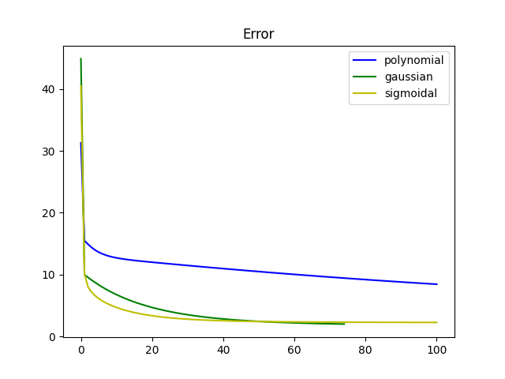
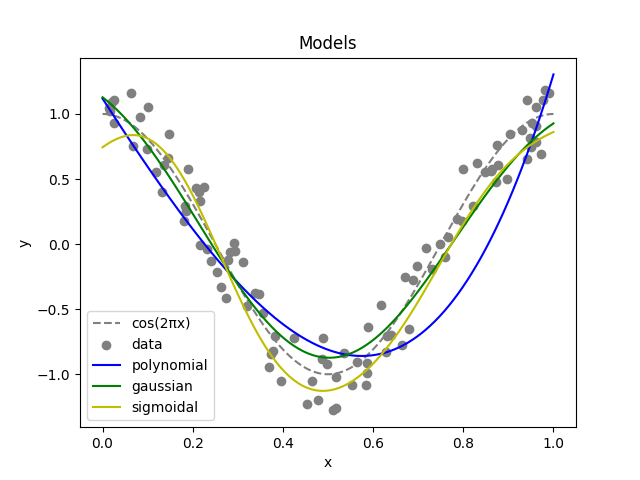

# Machine Learning

### Universidad Autónoma de Yucatán _Facultad de Matemáticas_

**Teacher:** Dr. Victor Uc Cetina <[victoruccetina@gmail.com](mailto:victoruccetina@gmail.com)>

**Student:** Ing. Dayan Bravo Fraga <[dayan3847@gmail.com](mailto:dayan3847@gmail.com)>

# Course 2: Neural Network Programming in Python

## Practice 2.1: "Gaussian and Sigmoidal Basis Functions"

Implementation of linear regression and logistic regression algorithms with Gaussian and Sigmoidal Basis Functions.

### Practice Instructions

> * Implementar los algoritmos de regresión lineal y regresión logística con funciones de base Gaussiana y sigmoidal.
> * Comparar y analizar el desempeño de estos dos algoritmos con respecto al uso de funciones de base polinomial,
    Gaussiana y sigmoidal.
> * Experimentar con datos artificiales generados con Sin(2 pi x) y Cos(2 pi x).

### Basic Function Analysis

### Linear Regression

#### Generate Data

#### `sin(2*pi*x)`

#### `cos(2*pi*x)`

### Code: [dayan3847/machine_learning/stochastic_gradient_descent_gaussian](https://github.com/dayan3847/machine_learning/blob/master/dayan3847/stochastic_gradient_descent_gaussian/gaussian.ipynb)

### Colab: 

## Practice 2.2: "Analysis of Weights within a Neural Network"

Analysis of how weights vary within a neural network when it is being trained

### Practice Instructions

> Implementar una Python Notebook que permita observar el cambio en los pesos de una red MLP conforme se va entrenando.
>
> Hacer experimentos con la base de datos iris, variando:
>
> * Número de capas: {2,3,4,5,6}
> * Función de activación: {Sigmoid, ReLu, Tanh}
> * Optimizer: {SGD, Adam}
>
> La función de activación de la última capa debe ser Softmax.
>
> Generar gráficas donde se observe como cambian los pesos durante el entrenamiento.

## Practice 2.3: "Multivariate Gaussian"

Linear Regression with two-dimensional Gaussian

### Practice Instructions

> Implementar un algoritmo de regresión lineal usando funciones de base Gaussianas para d dimensiones.

## Practice 2.4: "Q-Learning with Tables"

Implementation of the Q-learning algorithm storing knowledge in tables.

### Practice Instructions

> Implementar el algoritmo Q-learning para una tarea con estados y acciones discretos.

### Code: [Notebook](2_4_q_learning_tables/q_learning_cliff_walking_tables.ipynb)

### Preview:

#### Rewards Average

#### Best Action

## Practice 2.5: "Q-Learning with Gaussian"

Implementation of the Q-learning algorithm storing knowledge in Gaussian base functions.

### Practice Instructions

> Implementar el algoritmo Q-learning para estados continuos y acciones discretas, usando un aproximador de funciones de
> base Gaussiana para almacenar la función Q.

## **Practice 2.6:** "Q-Learning with Neural Network" _Final Project_

Implementation of the Q-learning algorithm storing knowledge in a neural network.

### Project Instructions

> * Q-learning con entradas contínuas en forma de vector de variables
> * Q-learning con entradas contínuas en forma de frames. Para esta opción consideramos el uso de Autoencoders al estilo
    world models.
> * Consideraciones: graficar curvas de recompensas para poder comparar diferentes variantes del algoritmo
