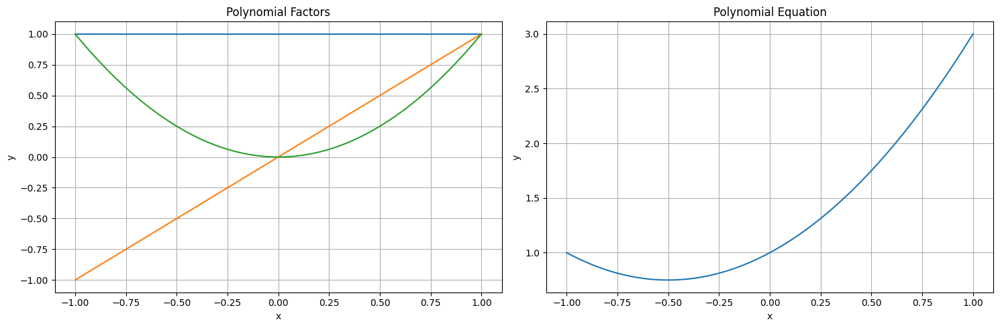
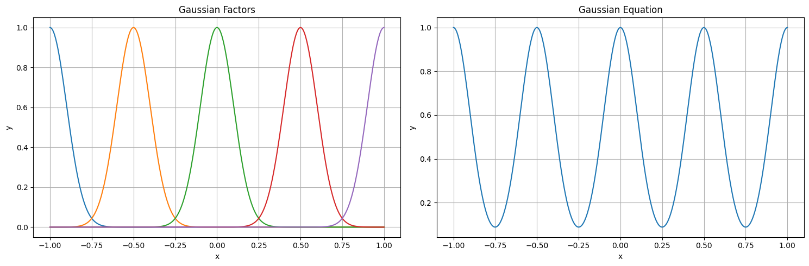
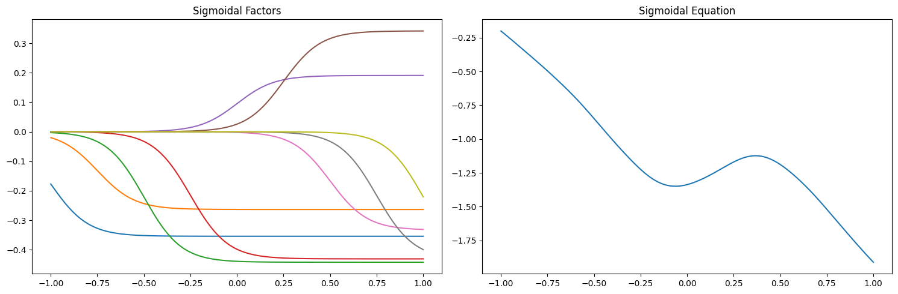

# Machine Learning

### Universidad Autónoma de Yucatán _Facultad de Matemáticas_

**Teacher:** Dr. Victor Uc Cetina <[victoruccetina@gmail.com](mailto:victoruccetina@gmail.com)>

**Student:** Ing. Dayan Bravo Fraga <[dayan3847@gmail.com](mailto:dayan3847@gmail.com)>

# Practice: Basis Functions

## Notebook: [Basis Functions](https://github.com/dayan3847/machine_learning/blob/master/dayan3847/basis_functions/basis_functions.ipynb)

## Colab: 

## Preview

### Polynomial

### Gaussian

### Sigmoid

