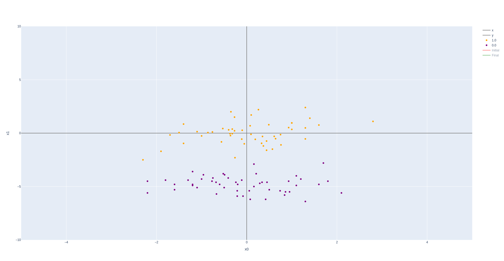
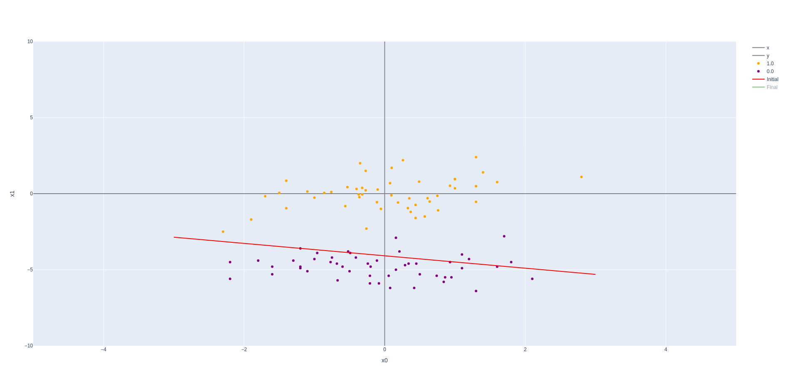
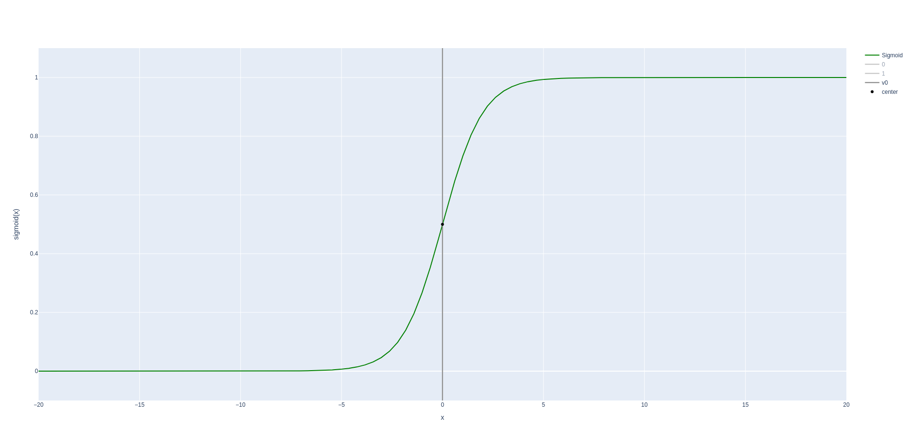
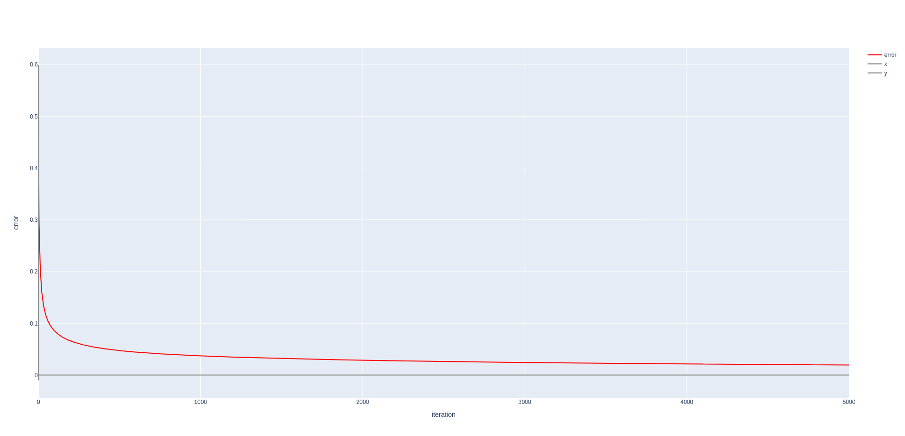
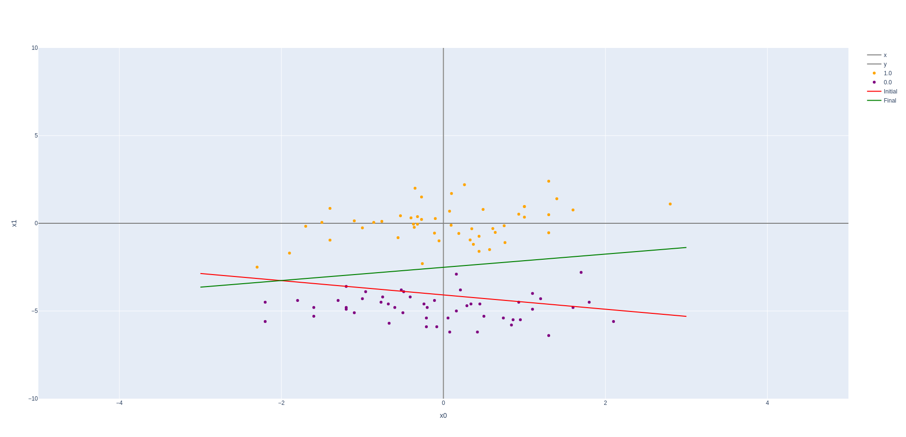
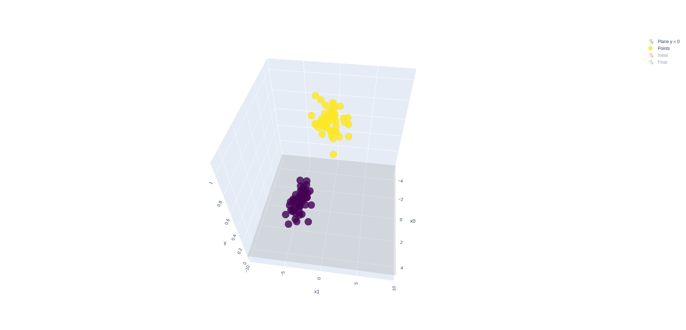
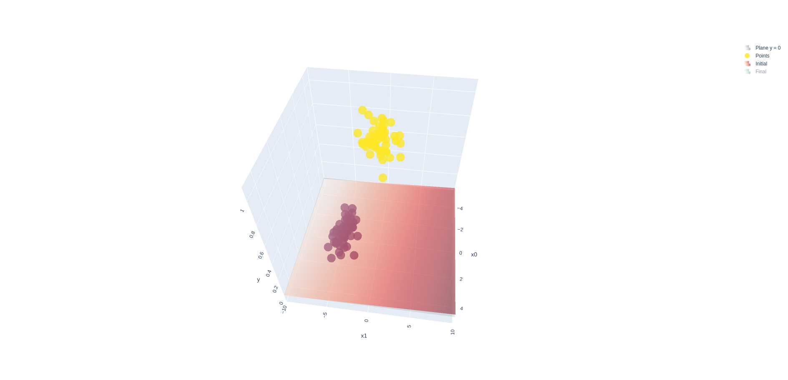
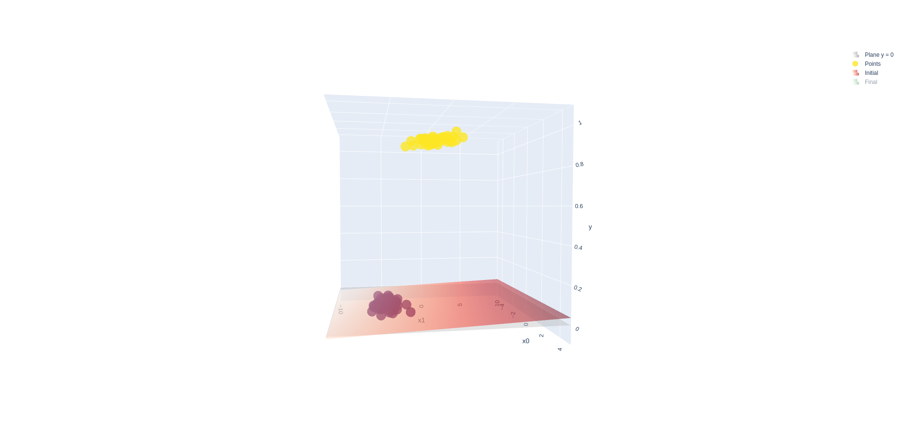
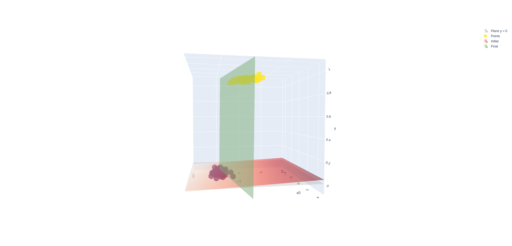
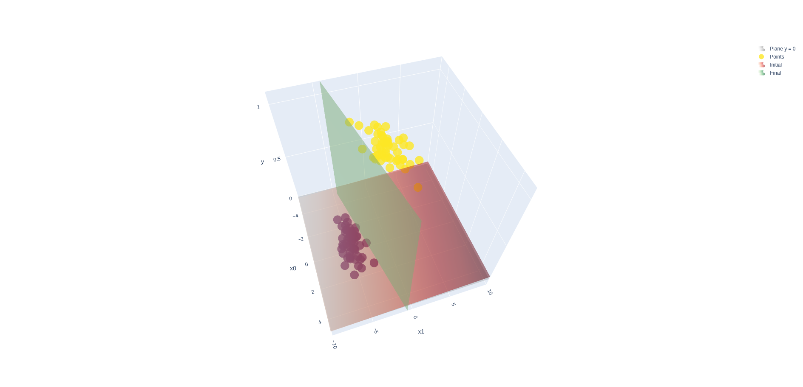

# Universidad Autónoma de Yucatán

### Maestría en Ciencias de la Computación

## Machine Learning

**Teacher:** Dr. Victor Uc Cetina

**Student:** Dayan Bravo Fraga

# Task2: Binary Classification through Logistic Regression

**GitHub**: https://github.com/dayan3847/machine_learning/tree/master/binary_classification

## Carga de Datos

Primero se cargan los datos del fichero "data.txt"

A continuación se pueden observar los datos en un gráfico en dos dimensiones

## Modelo Lineal

Este modelo será de la forma:

`y = θ0 + θ1x1 + θ2x2`

### Inicialización de Parámetros (Thetas) del Modelo (Polinomial)

Se inicializan los parámetros del modelo de regresión logística

    θ0 = 0.009421284312806045
    θ1 = 0.000938084445642258
    θ2 = 0.002306799894904883

Quedando el polinomio de la siguiente forma:

`y = 0.009421284312806045 + 0.000938084445642258x1 + 0.002306799894904883x2`

Esta sería la vista del modelo inicial en dos dimensiones

### Función Sigmoide

### Ejecución algoritmo de regresión logística

#### Parámetros

    Alpha:              0.01
    Iterations Count:   5000

#### Error

#### Resultados

##### Final Polinomial:

`12.990510632657198 -1.9475398659529926 * x0 +5.168836977458553 * x1`

    Initial Error: 0.4985981660660902
    Final Error: 0.0195441724429582

### Vistas en 3 Dimensiones

[3D Data](reports/2023-02-12_02-43-59/figure_3d_data.html)

