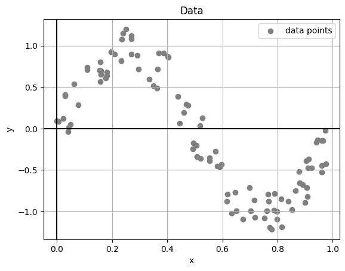
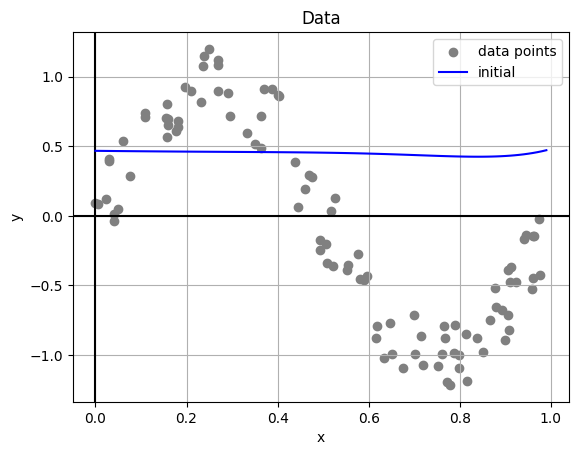
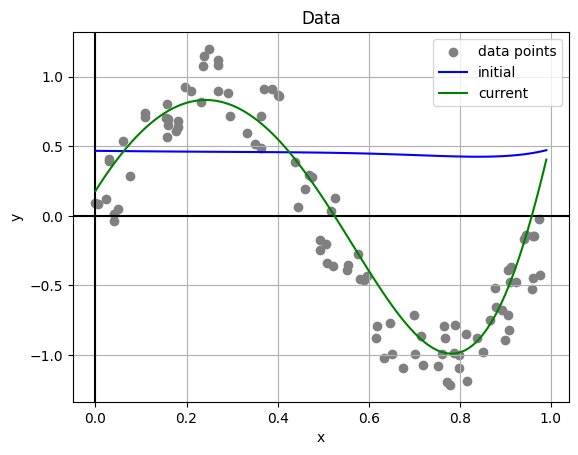
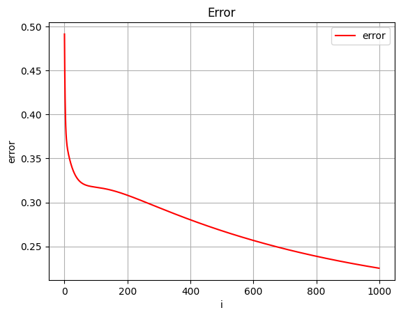

# Universidad Autónoma de Yucatán

### Maestría en Ciencias de la Computación

## Machine Learning

**Teacher:** Dr. Victor Uc Cetina

**Student:** Dayan Bravo Fraga

## Task1: Stochastic Gradient Descent

**GitHub**: https://github.com/dayan3847/mcc_ml_task1

### Generate artificial data points

Generate 100 artificial data points (xi, yi) where each xi is randomly generated from the interval [0, 1]
and yi = sin(2πxi) + ε. Here, ε is a random noise value in the interval [−0.3, 0.3].

#### Code

```python
from stochastic_gradient_descent.StochasticGradientDescentSinusoidal import StochasticGradientDescentSinusoidal

stochastic_gradient_descent = StochasticGradientDescentSinusoidal()
```

```python
# Generate Data Points
stochastic_gradient_descent.m = 100  # Artificial Count
stochastic_gradient_descent.generate_data_points()
stochastic_gradient_descent.plot_data()
```

#### Output

Artificial points have been generated:



### Initialize Polynomial Regression Model

#### Code

```python
# Polynomial Degree
stochastic_gradient_descent.d = 10
stochastic_gradient_descent.generate_initial_parameters()
stochastic_gradient_descent.plot_data(initial=True)
```

#### Output



### Implement the Stochastic Gradient Descent algorithm

Implement in your favorite programming language the Stochastic Gradient Descent algorithm to solve the regression
problem using the 100 data points you generated.

#### Code

```python
# Config
stochastic_gradient_descent.a = .1
stochastic_gradient_descent.iterations_count = 1000
stochastic_gradient_descent.run()
```

```python
stochastic_gradient_descent.update_graphics()
stochastic_gradient_descent.plot_data_all()
```

#### Output



### Graph Error

#### Output

Artificial points have been generated:



### Report

#### Code

```python
stochastic_gradient_descent.print_repo()
```

#### Output

    REPORT
    Alpha: 0.1
    Iterations: 1000
    Polynomial Degree: 10
    Initial Parameters:
    [0.46677296322219053, -0.03370197962794996, 0.03227652399952563, -0.05173263918867088, 0.2281721658090401, -0.26096446892334024, -0.4364644570563987, 0.22103365936575503, 0.11975197140330462, 0.4158777602247543, -0.2213609066880774]
    Final Parameters:
    [0.1781850707675413, 5.21901677271641, -9.42800778038868, -4.58050511813951, 1.2653788988816317, 3.4329440711012507, 3.528307364339632, 3.072591978765518, 1.219286963584696, -0.4234852617768883, -2.9412886689935944]
    Final Error:
    0.22522742738549179

#### PDF

[Report](reports/reportStochasticGradientDescentSinusoidal.pdf)
